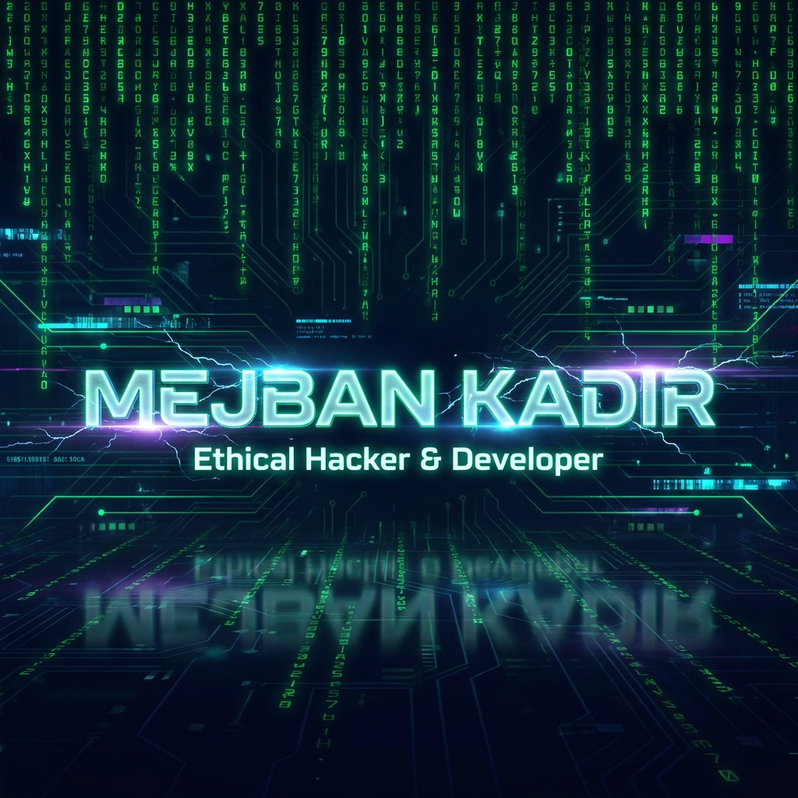
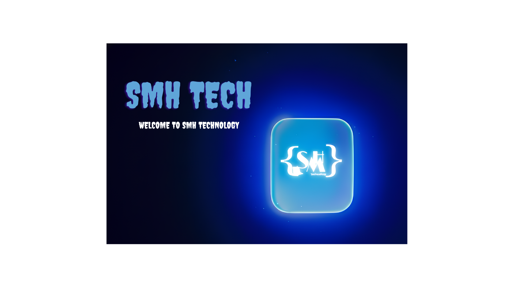
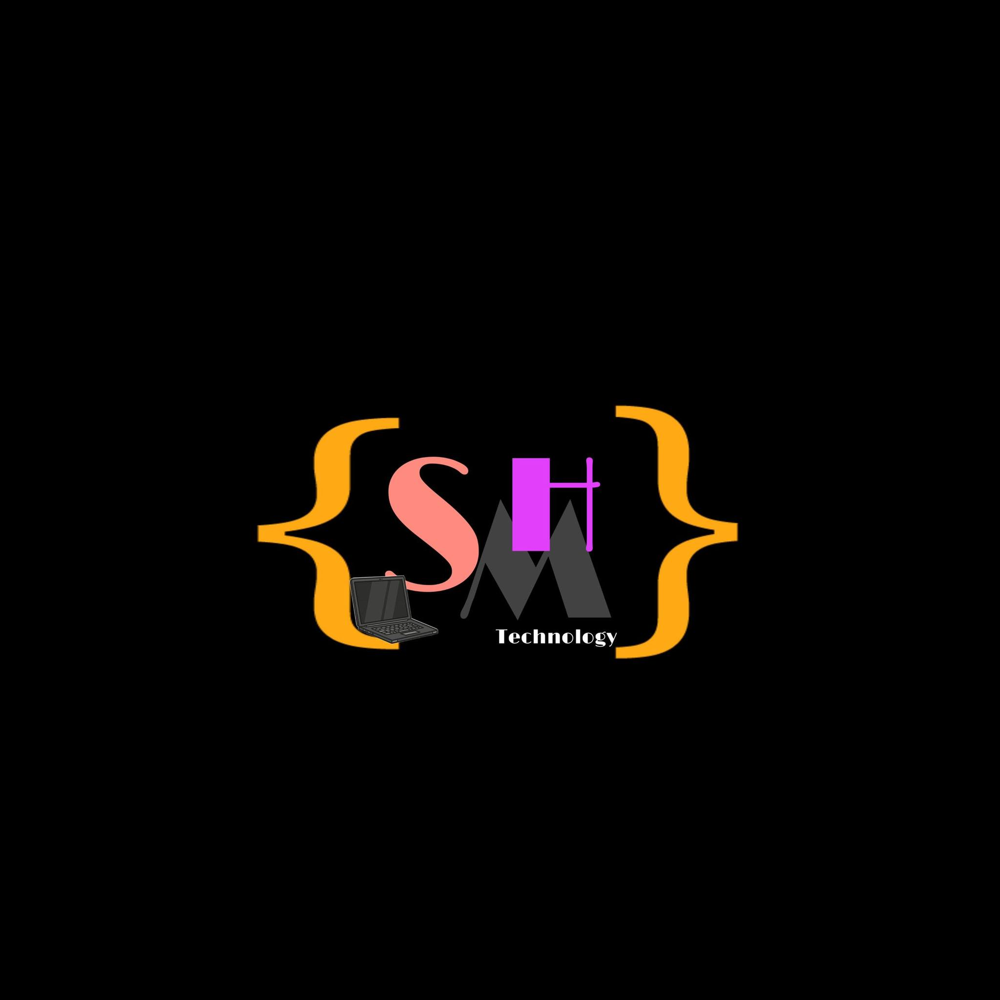

<!-- Sizing and Layout -->

<!-- Banner Image -->

<!-- Typing Effect Animation -->

<!-- Intro / Bio -->
<h3>
   
  Hi there, I'm Mejban Kadir!
</h3>

  <b>Co-Founder @ SMH Tech | Cybersecurity Enthusiast | Ethical Hacker</b>  
  🚀 <i>"I don't break systems, I make them stronger."</i>

<!-- Social Links (Badges) -->

  
  
  
  
  

---

<!-- About Me Section -->

## 👨‍💻 About Me

I am a passionate **Ethical Hacker** and **Software Developer** from **Bogura, Bangladesh**. I specialize in **Reverse Engineering**, **Exploit Development (WinAPI)**, **Web Vulnerability Assessment**, and **AI Solutions**. 

- 🔭 I’m currently working on open-source cybersecurity tools and **Kangaroo AI**.
- 🌱 I’m currently exploring **Rust** and advanced **Hardware** (Flipper Zero, WiFi Pineapple).
- 💼 I’m the owner of **SMH Tech**, helping companies secure their digital assets.
- 💬 Ask me about **Cybersecurity, Python Automation, and .NET Development**.
- ⚡ Fun fact: I built a **Flipper Zero replica with ESP32** from scratch!

---

<!-- Tech Stack Section -->

  <h2>🛠️ The Hacker's Arsenal</h2>
  
<!-- Unified Skill Icons -->
  
 
    
  

  
  <h3>🛡️ Security Tools</h3>
  

    
    
    
    
    
  

---

<!-- Projects Section -->
## 🚀 Featured Projects

| Project | Description | Tech Stack |
| :--- | :--- | :--- |
| **CockySubFinder** | An advanced subdomain finder tool designed for efficiency and speed in reconnaissance. | `Python`, `Web Scanning` |
| **SMH-DCTOOL** | A powerful Discord Multi-Tool: IP Grabbing, Nitro Brute Force, Webhook Management. | `C++` |
| **Win11 Smart Tool** | Desktop utility for Windows 11 optimization and RAM cleaning (Mem Reduct style). | `C++/CLI`, `WinForms` |
| **Kangaroo AI** | Innovative AI solution developed under SMH Tech. | `AI`, `Machine Learning` |
| **react2shell** | Exploit extension to exploit React2Shell vulnerabilities. | `JavaScript`, `Exploit` |

---

<!-- GitHub Analytics Section -->

  <h2>📊 GitHub Analytics</h2>
  
 
  <!-- Stretch Graph -->
  

---

<!-- Image Gallery -->

  <h2>📸 My World </h2>
  
  
  
  
   
  
  
  
   
  <h3>Exploit Work</h3>
  

---

<!-- Footer / Contact -->

  <h3>⚡ "Security is not a product, it's a process." ⚡</h3>
  
  

    Join <b>Mejban's HackShield</b> for tutorials and livestreams!  
    <a href="https://www.youtube.com/@Hack-With-Mejban">Subscribe</a>
  

  
  

